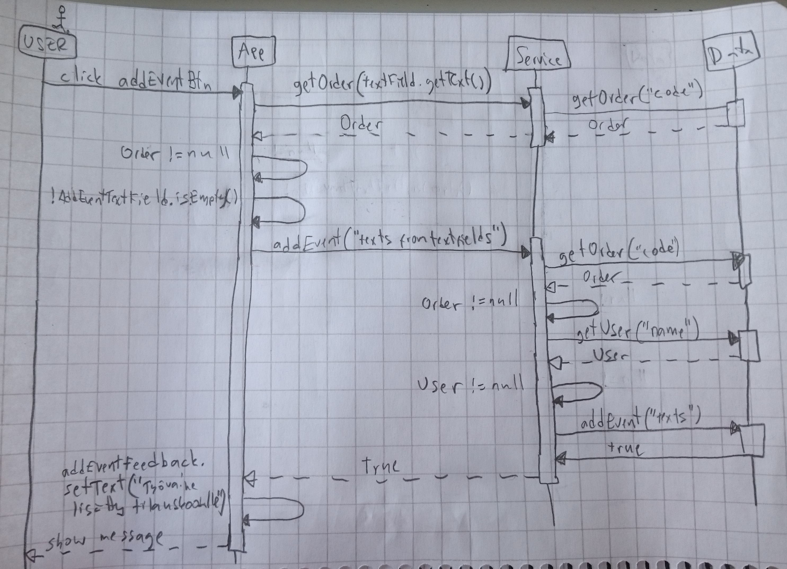

# Arkkitehtuurikuvaus

## Rakenne

Ohjelman rakenne koostuu kolmesta kerroksesta. Pakkaus ui, sisältää käyttöliittymän joka on toteutettu JavaFX:llä,
domain-pakkauksessa on sovelluslogiikka ja database käsittelee tietokantaa.

Pakkauskaavio:

 


## Käyttöliittymä

Käyttöliittymä sisältää kolme erillistä päänäkymää ja kahdessa niistä on lisää vaihdettavia näkymiä

- Kirjautumisnäkymä
- Tuotanto-näkymä
  - Uuden tilauksen luomisnäkymä
  - Uuden työvaiheen luomisnäkymä
  - Tilauksen etsimisnäkymä koodilla
  - Tilauksen etsimisnäkymä päivämäärällä
- Hallinta-näkymä
  - Tilastonäkymä
  - Käyttäjän hallinta -näkymä
  - Asetusnäkymä

Kirjautumisnäkymä on toteutettu Scene-oliona (beginScene). Sisäänkirjautumisen jälkeen stageen sijoitetaan näytettäväksi toinen Scene-olio (workScene), johon on toteutettu loput näkymäsiirtymät. Hallinta- sekä tuotanto-näkymä ovat kenttiä, jotka tulevat näkyviin workSceneen yksi kerrallaan, rippuen valitusta painikkeesta. Tämä toteutustapa on valittu siksi, että pystytään käyttämään samoja siirtymänappeja molemmissa näkymissä.
Uloskirjautuessa stageen sijoitetaan uudelleen näytettäväksi kirjautumisnäkymä Scene-olio (beginScene). 
Käyttöliittymä on rakennettu luokassa dicip.ui.App.

Käyttöliittymä on pyritty eristämään sovelluslogiikasta. Se kutsuu luokan dicip.domain.Service metodeja ja oikeastaan vain toimii välikätenä tiedon välittämisessä ja näyttämisessä käyttäjälle. 

Käyttöliittymä huolehtii virheilmoitusten näyttämisestä käyttäjälle, kun käyttäjä yrittää syöttää virheellisiä tietoja kenttiin. Varsinaisen tiedon oikeellisuuden kuitenkin tarkistaa sovelluslogiikasta huolehtiva luokka dicip.domain.Service.


## Sovelluslogiikka

Keskeistä dataa tässä sovelluksessa edustavat oliot User, Order ja WorkPhase, jotka kuvaavat käyttäjiä, tilauksia ja näihin molempiin liittyviä työvaiheita.

Luokkien keskinäiset suhteet nähdään luokkakaaviosta:


Käyttöliittymä (ui) saa sovelluslogiikan käyttöönsä domain-pakkauksen Service-luokasta. Service käsittelee tietokantaa ja saa tietokannan kautta käsiteltäväkseen olioita User, Order ja WorkPhase.
Tietokantaluokka toteuttaa rajapinnan Data ja tässä sovelluksessa on luotu kaksi tietokantaluokkaa, DataSql ja DataMap, joista jälkimmäinen on vain testausta varten.

Pakkaus/luokkakaaviosta näkee luokkien ja pakkausten suhteet toisiinsa.


### Päätoiminnallisuudet

Näytetään muutama toiminnalisuus sekvenssikaaviona.

#### Käyttäjän kirjautuminen sisään

Kun käyttäjä kirjoittaa tekstikenttään olemassaolevan admin-statuksella varustetun käyttäjätunnuksen ja klikkaa painiketta "Kirjaudu sisään" (loginBtn), kontrolli etenee ohjelmassa seuraavasti:

 

Käyttöliittymän (App) tapahtumakäsittelijä reagoi painikkeen painamiseen kutsumalla sovelluslogiikkaluokan *Service* metodia *login*, jolle annetaan parametriksi teksikenttään syötetty teksti, eli käyttäjätunnuksen nimi. *Service* kutsuu rajapinnan *Data* metodia *getUser* saadakseen tietää onko kyseinen käyttäjä olemassa annetun nimen perusteella. Jos käyttäjä löytyy, *getUser* palauttaa olion *User*, joka sisältää kyseisen käyttäjätunnuksen nimen ("Leo") ja käyttäjästatuksen (tässä tapauksessa status on 'admin' eli työnjohtaja, jota merkintään numerolla 1). Käyttäjä merkitään *Servicen* oliomuuttujaan loggedInUser sisäänirjautuneeksi käyttäjäksi. Käyttäjän löydyttyä *Service* palauttaa käyttöliittymälle (App) arvon *true*.

Seuraavaksi *App* pyytää *Service*ltä kirjautuneen käyttäjän (olion User) metodilla getLoggedInUser selvittääkesen tämän käyttäjästatuksen metodilla *getStatus*, jolle annetaan parametriksi olio *User*. Saatuaan tietoon että käyttäjän status on '1', *App* ottaa adminBtn-napin takaisin käyttöön (lähtökohtaisesti nappi on poissa käytöstä), ja asettaa näkymäksi workScenen, eli sovelluksen varsinaisen käyttönäkymän. Tässä yhteydessä *App* myös klikkaa itse nappia *orderBtn* saadakseen tilaustenhallinta-kentän (workField) workScenen valituksi ja nähtäväksi kentäksi.

Nyt käyttäjä näkee tilausten etsimiseen ja lisäämiseen tarkoitutetut napit oikealla puolella ikkunaa ja vasemalla kenttien välillä siirtymiseen tarkoitetut napit sekä uloskirjautumisnapin. Myös 'Hallinta'-kentän näyttävä siirtymisnappi on käytössä.


#### Käyttäjän kirjautuminen ulos

Kun sisään kirjautunut käyttäjä klikkaa painiketta "Kirjaudu ulos" (logOutBtn), kontrolli etenee ohjelmassa seuraavasti:

 

Käyttöliittymän (App) tapahtumakäsittelijä reagoi painikkeen painamiseen kutsumalla sovelluslogiikkaluokan *Service* metodia *logOut*. Service merkitsee sisäänkirjautuneen käyttäjän paikalle arvon *null* ja palauttaa käyttöliittymälle *true*.
Käyttöliittymä vaihtaa nyt näkymän takaisin aloitusnäkymäksi (beginScene) ja muuttaa samalla tekstikenttien arvot takaisin lähtötilanteeseen. 

### Työvaiheen lisääminen

Kun käyttäjä kirjoittaa työvaihetta lisätessään kenttiin olemassa olevan tilauksen tunnuksen ja täyttää pakolliset kentät, kontrolli etenee ohjelmassa seuraavasti:

 

Käyttöliittymän (App) tapahtumakäsittelijä reagoi painikkeen painamiseen kutsumalla ensimmäiseksi sovelluslogiikkaluokan *Service* metodia *getOrder*, joka ottaa parametrikseen tekstikenttään kirjoitetun koodin. Service kysyy tietokantaa käsittelevältä rajapinnalta *Data*, onko kyseisellä koodilla olevaa tilausta olemassa. Jos on, *Data* hakee tietokannasta kyseisen tilauksen tiedot ja muodostaa siitä olion *Order* jonka se palauttaa *Servicelle* joka palauttaa sen *App*:ille. *App* tarkistaa onko olio *null* vai ei, koska ei ole, niin seuraavaksi ohjelma tarkistaa onko työvaihetta kuvaava kenttä täytetty, jos on, tapahtumakäsittelijä kutsuu seuraavaksi *Service*-luokan metodia *addEvent* ja antaa parametreiksi tekstikenttien tekstit.

*Service* tarkistaa *Datalta* vielä, ovatko kyseinen tilaus ja käyttäjä olemassa, jos palautuneet arvot eivät ole *null*, niin seuraavaksi *Service* pyytää *Data*a lisäämään työvaiheen tietokantaan metodilla *addEvent*. Kun lisäys on tehty, *Data* palauttaa arvon *true*. *Service*n metodi *addEvent* välittää arvon *true* käyttölii

## Tietojen pysyväistallennus

Pakkauksen dicip.database luokka DataSql huolehtii tietojen tallentamisesta tietokantaan.

Luokka noudattavaa Data Access Object -suunnittelumallia. Se toteuttaa rajapinnan *Data* ja näin tietojen tallentamisen toteutustapa on helppo vaihtaa tekemällä toinen luokka joka toteuttaa saman rajapinnan. Näin on tehtykin jo testausta varten, luomalla *Data*n toteuttava luokka *DataMap*, joka ei käytä SQL:ää. 
Sovelluslogiikka on siis eristetty tietokannan käsittelystä.

### Tiedostot

Kaikki tieto tallennetaan samaan tietokantatiedostoon, jonka nimi määritellään *config.properties* tiedostossa. Tiedosto on sijoitettu sovelluksen juureen.
Jokaiselle eri tietotyypille on tietokannassa omat tietokantataulunsa. Taulujen tietoja yhdistellään id:n ja tilauskoodin perusteella, joten jos jotain tietoa täytyy muuttaa, niin se tarvitsee muuttaa vain yhdestä taulutsa. 
Taulut on eritelty samalla tavalla kuin sovelluslogiikkakerroksen oliot (Order, User, WorkPhase). Tietokantataulut ovat nimeltään Orders, Users ja Events ja sisältävät muuten samat tiedot kuin niitä vastaavien olioiden oliomuuttujat, mutta lisäksi Users ja Events listoissa olevilla alkioilla on id:t. Orders listan alkioiden id:nä toimii tilauskoodi.

Tietokantaa kuvaava SQL-skeema:
```
CREATE TABLE Users (id INTEGER PRIMARY KEY, name TEXT UNIQUE, status INTEGER)
CREATE TABLE Orders (code TEXT UNIQUE PRIMARY KEY, timestamp TEXT, usr_id INTEGER REFERENCES Users)
CREATE TABLE Events (id INTEGER PRIMARY KEY, workphase TEXT, code TEXT NOT NULL REFERENCES Orders, usr_id REFERENCES Users, description TEXT, timestamp TEXT)
```
Skeemasta nähdään, että tietokanta jo itsessään tarkistaa, että lisättävän työvaiheen tilauskoodi ja käyttäjä id löytyy tietokannasta, ettei tietokantaan voi päätyä työvaiheita jotka eivät ole kenekään tekemiä tai että ne on tehty olemattomalle tilaukselle. Nämä tarkistukset tehdään myös luokassa *Service*, virhetilanteiden (esim. nullpointereiden) minimoimikseksi. Tietokanta pitää myös siitä huolen ettei samannimisiä käyttäjiä voi olla eikä samalla koodilla olevia tilauksia.

## Ohjelman rakenteeseen jääneet heikkoudet

* Käyttöliittymän koodia ei juurikaan ole pilkottu metodeihin tai luokkiin, joka voisi selkeyttää sitä.
* Ohjelma käyttää suurta määrää muuttujia ja niiden nimet ovat aika samantyyppisiä, joten se voi olla sekavaa. Nimentää voisi parantaa. 
* Tietokantaa käsittelevät metodit pystyisi ehkä rakentamaan niin että tietokantaan lisäävät metodit käyttäisivät samaa luokasta tai metodista tehtyä pohjaa ja tietokannasta poistavat toiminnot toista samaa pohjaa. Tällä hetkellä jokaisella tietokantatoiminnolla on oma metodi.
* Data-rajapinnan tietokantaa käsittelevät metodit on valittu siten, että osa laskennasta on jätetty sovelluslogiikan tehtäväksi. Tähän voisi vetää selkeämmän rajan, että mitä toimintoja Data-luokat tekevät ja mitä sovelluslogiikkaluokat. Joko Data-rajapinnan metodeja voisi jättää yksinkertaisemmiksi yleismetodeiksi tai sitten toisin päin, että tekisi monimutkaisia tietokantahakuja ja siten helpottaisi sovelluslogiikan vastuulle jääviä tehtäviä.
