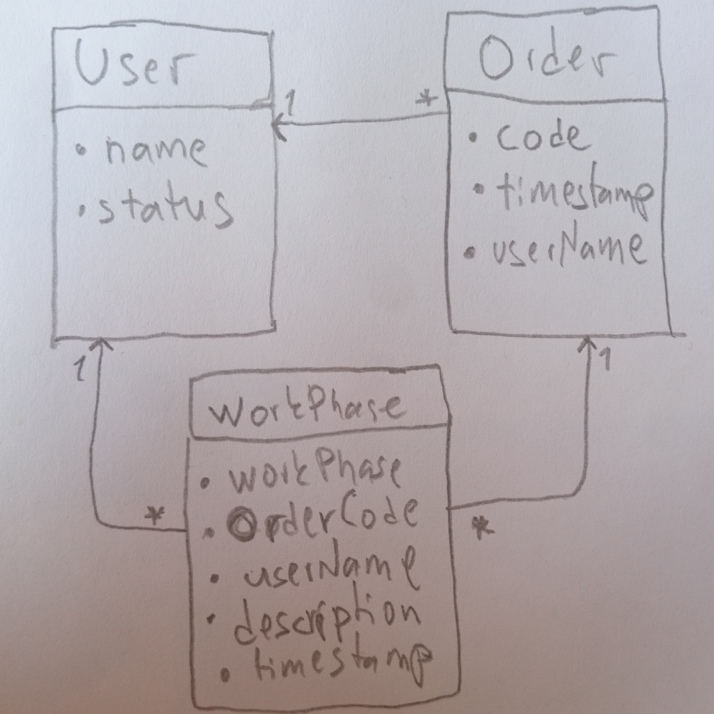
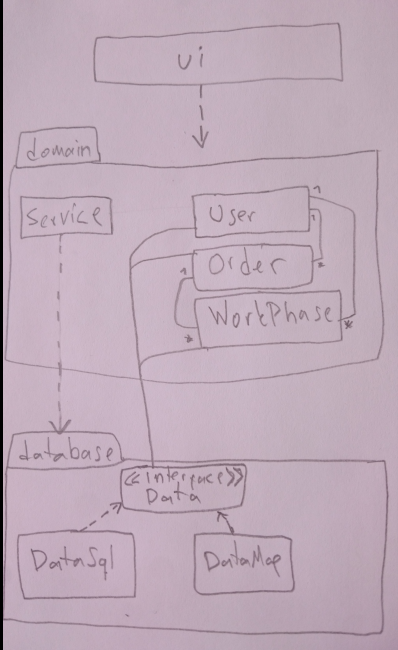
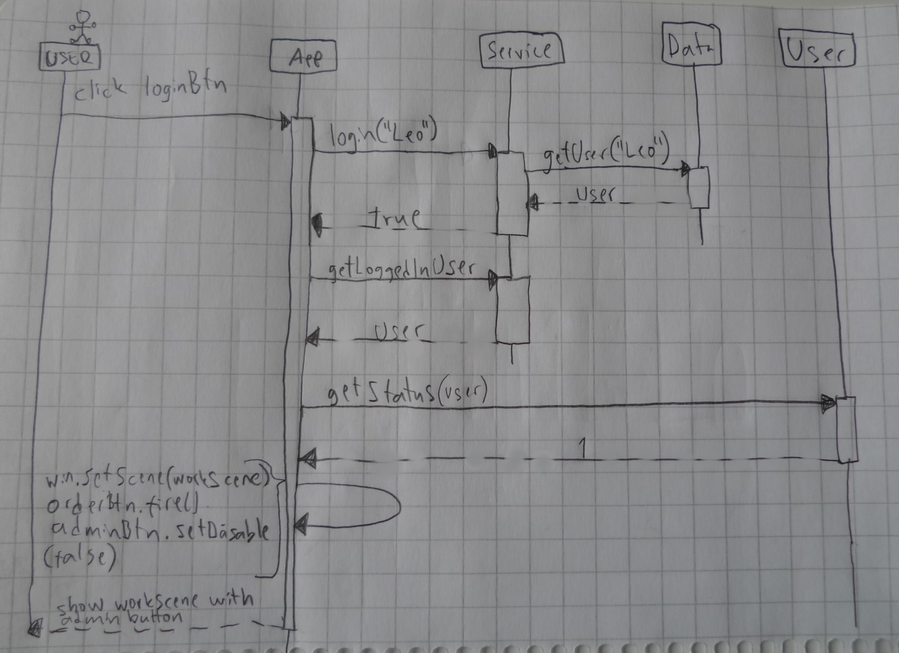
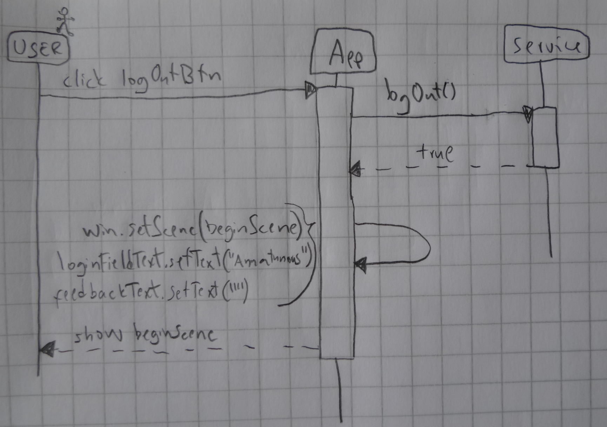

# Arkkitehtuurikuvaus

## Rakenne

Ohjelman rakenne koostuu kolmesta kerroksesta. Pakkaus ui, sisältää käyttöliittymän joka on toteutettu JavaFX:llä,
domain-pakkauksessa on sovelluslogiikka ja database käsittelee tietokantaa.

Pakkauskaavio:

 

## Käyttöliittymä

Käyttöliittymä sisältää kolme erillistä päänäkymää ja kahdessa niistä on lisää vaihdettavia näkymiä

- Kirjautumisnäkymä
- Tuotanto-näkymä
  - Uuden tilauksen luomisnäkymä
  - Uuden työvaiheen luomisnäkymä
  - Tilauksen etsimisnäkymä koodilla
  - Tilauksen etsimisnäkymä päivämäärällä
- Hallinta-näkymä
  - Tilastonäkymä
  - Käyttäjän hallinta -näkymä
  - Asetusnäkymä

Kirjautumisnäkymä on toteutettu Scene-oliona (beginScene). Sisäänkirjautumisen jälkeen stageen sijoitetaan näytettäväksi toinen Scene-olio (workScene), johon on toteutettu loput näkymäsiirtymät. Hallinta- sekä tuotanto-näkymä ovat kenttiä, jotka tulevat näkyviin workSceneen yksi kerrallaan, rippuen valitusta painikkeesta. Tämä toteutustapa on valittu siksi, että pystytään käyttämään samoja siirtymänappeja molemmissa näkymissä.
Uloskirjautuessa stageen sijoitetaan uudelleen näytettäväksi kirjautumisnäkymä Scene-olio (beginScene). 
Käyttöliittymä on rakennettu luokassa dicip.ui.App.

Käyttöliittymä on pyritty eristämään sovelluslogiikasta. Se kutsuu luokan dicip.domain.Service metodeja ja oikeastaan vain toimii välikätenä tiedon välittämisessä ja näyttämisessä käyttäjälle. 

Käyttöliittymä huolehtii virheilmoitusten näyttämisestä käyttäjälle, kun käyttäjä yrittää syöttää virheellisiä tietoja kenttiin. Varsinaisen tiedon oikeellisuuden kuitenkin tarkistaa sovelluslogiikasta huolehtiva luokka dicip.domain.Service.

## Sovelluslogiikka

Keskeistä dataa tässä sovelluksessa edustavat oliot User, Order ja WorkPhase, jotka kuvaavat käyttäjiä, tilauksia ja näihin molempiin liittyviä työvaiheita.

Luokkien keskinäiset suhteet nähdään luokkakaaviosta:

Käyttöliittymä (ui) saa sovelluslogiikan käyttöönsä domain-pakkauksen Service-luokasta. Service käsittelee tietokantaa ja saa tietokannan kautta käsiteltäväkseen olioita User, Order ja WorkPhase.
Tietokantaluokka toteuttaa rajapinnan Data ja tässä sovelluksessa on luotu kaksi tietokantaluokkaa, DataSql ja DataMap, joista jälkimmäinen on vain testausta varten.

Pakkaus/luokkakaaviosta näkee luokkien ja pakkausten suhteet toisiinsa.

### Päätoiminnallisuudet

Näytetään muutama toiminnalisuus sekvenssikaaviona.

#### Käyttäjän kirjautuminen sisään

Kun käyttäjä kirjoittaa tekstikenttään olemassaolevan admin-statuksella varustetun käyttäjätunnuksen ja klikkaa painiketta "Kirjaudu sisään" (loginBtn), kontrolli etenee ohjelmassa seuraavasti:

 

Käyttöliittymän (App) tapahtumakäsittelijä reagoi painikkeen painamiseen kutsumalla sovelluslogiikkaluokan *Service* metodia *login*, jolle annetaan parametriksi teksikenttään syötetty teksti, eli käyttäjätunnuksen nimi. *Service* kutsuu rajapinnan *Data* metodia *getUser* saadakseen tietää onko kyseinen käyttäjä olemassa annetun nimen perusteella. Jos käyttäjä löytyy, *getUser* palauttaa olion *User*, joka sisältää kyseisen käyttäjätunnuksen nimen ("Leo") ja käyttäjästatuksen (tässä tapauksessa status on 'admin' eli työnjohtaja, jota merkintään numerolla 1). Käyttäjä merkitään *Servicen* oliomuuttujaan loggedInUser sisäänirjautuneeksi käyttäjäksi. Käyttäjän löydyttyä *Service* palauttaa käyttöliittymälle (App) arvon *true*.

Seuraavaksi *App* pyytää *Service*ltä kirjautuneen käyttäjän (olion User) metodilla getLoggedInUser selvittääkesen tämän käyttäjästatuksen metodilla *getStatus*, jolle annetaan parametriksi olio *User*. Saatuaan tietoon että käyttäjän status on '1', *App* ottaa adminBtn-napin takaisin käyttöön (lähtökohtaisesti nappi on poissa käytöstä), ja asettaa näkymäksi workScenen, eli sovelluksen varsinaisen käyttönäkymän. Tässä yhteydessä *App* myös klikkaa itse nappia *orderBtn* saadakseen tilaustenhallinta-kentän (workField) workScenen valituksi ja nähtäväksi kentäksi.

Nyt käyttäjä näkee tilausten etsimiseen ja lisäämiseen tarkoitutetut napit oikealla puolella ikkunaa ja vasemalla kenttien välillä siirtymiseen tarkoitetut napit sekä uloskirjautumisnapin. Myös 'Hallinta'-kentän näyttävä siirtymisnappi on käytössä.

#### Käyttäjän kirjautuminen ulos

Kun sisään kirjautunut käyttäjä klikkaa painiketta "Kirjaudu ulos" (logOutBtn), kontrolli etenee ohjelmassa seuraavasti:

 

Käyttöliittymän (App) tapahtumakäsittelijä reagoi painikkeen painamiseen kutsumalla sovelluslogiikkaluokan *Service* metodia *logOut*. Service merkitsee sisäänkirjautuneen käyttäjän paikalle arvon *null* ja palauttaa käyttöliittymälle *true*.
Käyttöliittymä vaihtaa nyt näkymän takaisin aloitusnäkymäksi (beginScene) ja muuttaa samalla tekstikenttien arvot takaisin lähtötilanteeseen. 
