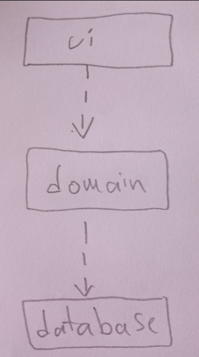

# Arkkitehtuurikuvaus

## Rakenne

Ohjelman rakenne koostuu kolmesta kerroksesta. Pakkaus ui, sisältää käyttöliittymän joka on toteutettu JavaFX:llä,
domain-pakkauksessa on sovelluslogiikka ja database käsittelee tietokantaa.

Pakkauskaavio:

 

## Sovelluslogiikka

Keskeistä dataa tässä sovelluksessa edustavat oliot User, Order ja WorkPhase, jotka kuvaavat käyttäjiä, tilauksia ja näihin molempiin liittyviä työvaiheita.

Luokkien keskinäiset suhteet nähdään luokkakaaviosta:

Käyttöliittymä (ui) saa sovelluslogiikan käyttöönsä domain-pakkauksen Service-luokasta. Service käsittelee tietokantaa ja saa tietokannan kautta käsiteltäväkseen olioita User, Order ja WorkPhase.
Tietokantaluokka toteuttaa rajapinnan Data ja tässä sovelluksessa on luotu kaksi tietokantaluokkaa, DataSql ja DataMap, joista jälkimmäinen on vain testausta varten.

Pakkaus/luokkakaaviosta näkee luokkien ja pakkausten suhteet toisiinsa.

### Päätoiminnallisuudet

Näytetään muutama toiminnalisuus sekvenssikaaviona

#### Käyttäjän kirjautuminen

Kun käyttäjä kirjoittaa tekstikenttään olemassaolevan admin-statuksella varustetun käyttäjäätunnuksen ja klikkaa painiketta "loginBtn", kontrolli etenee ohjelmassa seuraavasti:

 
