# Käyttöohje

Lataa tiedosto [tuotannonohjaus.jar](https://github.com/Skorp7/ot-harjoitustyo/releases/tag/viikko7) ja konfigurointitiedosto config.properties.

## Konfigurointi

Ohjelma olettaa käynnistyessään että samasta kansiosta .jar -tiedoston kanssa löytyy tiedosto *config.properties*.

Konfigurointitiedoston sisältö on seuraava:
```
dataFile=jdbc:sqlite:datafile.db
```

Ohjelma luo käynnistyessään tietokantatiedoston *datafile.db* samaan kansioon, johon .jar-tiedosto on ladattu. Jos olet ladannut saman ohjelman eri version aiemmin, kannattaa poistaa vanha versio ja vanha tietokantatiedosto ennen käynnistämistä.

>Voit testata ohjelmaa myös jo valmiiksi täydennetyllä tietokannalla. Jos haluat sen testikäyttöön, voit ladata tiedoston *datafileForTutorial.db* ja tallentaa sen samaan kansioon .jar-tiedoston kanssa. Tällöin sinun täytyy myös muuttaa tiedoston *config.properties* sisältö seuraavaksi:
```
dataFile=jdbc:sqlite:datafileForTutorial.db
```


## Ohjelman käynnistäminen

Ohjelman voi käynnistää komentoriviltä menemällä siihen kansioon jossa .jar-tiedosto sijaitsee ja kirjoittamalla komennon:

```
java -jar tuotannonohjaus.jar
```

## Sisäänkirjautuminen

Ensimmäisen käynnistyksen jälkeen voi kirjautua sisään tunnuksella 'admin', jolla on kaikki käyttöoikeudet. Kirjoita nimi kenttään ja klikkaa 'Kirjaudu'.

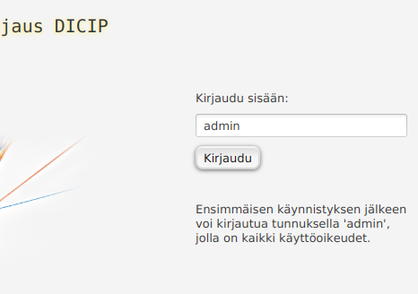

## Uloskirjautuminen

Klikkaa vasemmalla alimpana olevaa painiketta "Kirjaudu ulos".

## Työnjohtajan toiminnot:

Työnjohtajan toimintoihin pääsee käsiksi menemällä vasemmanpuoleisesta valikosta kohtaan 'Hallinta'. Aukeaa hallinta-näkymä joka aukeaa vain *Työnjohtajan* oikeuksilla.

### Käyttäjän lisääminen ja poistaminen

Voi esimerkiksi ensimmäisenä käydä luomassa toisen tunnuksen, jolla on kaikki käyttöoikeudet ja poistaa tunnuksen 'admin'.

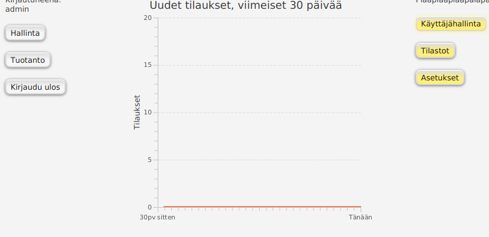

Valitse sitten oikeanpuolimmaisesta valikosta 'Käyttäjänhallinta' ja 'Lisää käyttäjä'. Valitse käyttäjärooliksi *Työnjohtaja*.


Klikkaa painiketta 'Lisää käyttäjä'. Ruutuun tulee palaute, onnistuiko käyttäjän lisääminen vai ei.

Jos onnistui, nyt voit halutessasi poistaa tunnuksen 'admin'. 
Se onnistuu menemällä ylävalikosta kohtaan 'Poista käyttäjä'. Kirjoita tekstikenttään 'admin' ja klikkaa "Poista käyttäjä". Vastaa myös varoitusviestiin OK. Ohjelma kirjaa sinut nyt automaattisesti ulos ja voit kirjautua takaisin sisään juuri luomallasi toisella tunnuksella.

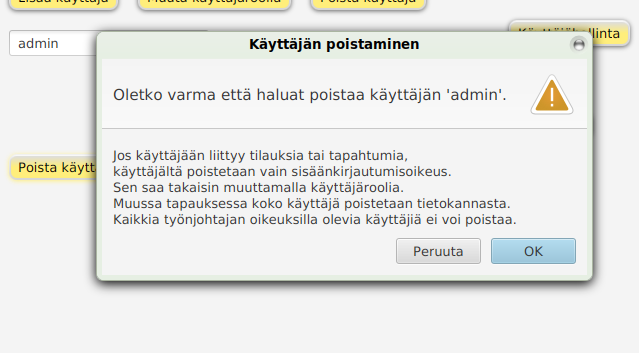

Ohjelma pitää huolen siitä, että tietokannassa on aina vähintään yksi käyttäjä, jolla on *Työnjohtajan* oikeudet. Ainoaa jäljellä olevaa *Työnjohtajaa* ei siis voi poistaa tai sen käyttäjäroolia muuttaa.
Ohjelma ei myöskään poista kokonaan sellaisia käyttäjiä, jotka ovat jo luoneet tilauksia tai tehneet työvaihemerkintöjä, ettei tilastoista häviä tietoa. Näiltä käyttäjiltä poistataan vain sisäänkirjautumisoikeus, jonka *Työnjohtajan* oikeuksilla voi antaa myöhemmin takaisin (kts. käyttäjäroolin vaihtaminen).

### Käyttäjäroolin vaihtaminen

Käyttäjäroolia voi vaihtaa menemällä käyttäjähallintaan ja klikkaamalla 'muuta käyttäjäroolia'-painiketta yläreunasta. Kirjoita kenttään sen käyttäjän nimi, jonka roolia haluat vaihtaa ja valitse uusi rooli. Olemattomasta käyttäjästä tulee virheviesti. Jos ohjelmassa on vain yksi käyttäjä *Työnjohtajan* oikeuksilla, niin tämän käyttäjän roolia ei voi vaihtaa.

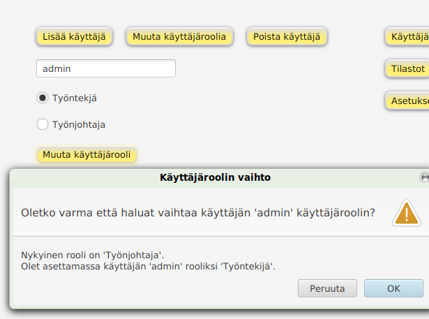

### Tietokannan tyhjentäminen

**HUOM! Älä tyhjennä tietokantaa ellet ole täysin varma että haluat tehdä sen!**

Mene oikeanpuolimmaisesta valikosta kohtaan 'Asetukset' ja valitse 'Tyhjennä tietokanta'. Järjestelmä antaa siitä varoitusviestin. Jos olet varma aikeistasi, niin klikkaa OK.

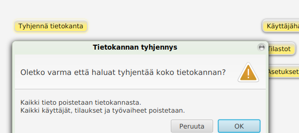

## Tuotannon toiminnot

Pääset lisäämään ja katsomaan tilauksia ja työvaiheita menemällä vasemmasta valikosta kohtaan 'Tuotanto'. Tämä toiminto on käytettävissä sekä *Työnjohtajan* että *Työntekijän* oikeuksilla.

### Tilauksen luominen

Voit luoda uuden tilauksen klikkaamalla oikeasta reunasta painiketta 'Luo uusi tilaus'. Tässä ohjelman versiossa tilauksen ID eli tilauskoodi pitää keksiä itse. Anna jokin keksimäsi tilauskoodi ja klikkaa 'Lisää tilaus'.

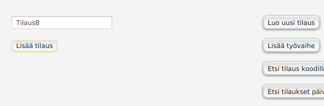

Jos koodi on jo olemassa, ohjelma näyttää painikkeen, jota klikkaamalla saat tehtyä vanhalle tilaukselle uuden sisäänkirjauksen. (Esimerkiksi siinä tapauksessa että sama tilaus on käynyt välitarkastuksessa asiakkaalla ja tulee takaisin tuotantoon.) Jos kyse on vanhasta tilauksesta, klikkaa painiketta. Muutta tapauksessa keksi toinen tilauskoodi.

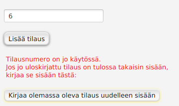

Jos klikkaat painiketta, siirryt työvaiheen lisäys -näkymään kentät valmiiksi täytettynä. Klikkaa sitten 'Lisää työvaihe'.

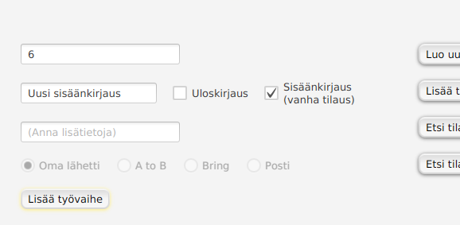

### Työvaiheen lisääminen

Voit lisätä tilaukselle työvaiheen klikkaamalla oikesta reunasta painiketta 'Lisää työvaihe'. Myös työn uloskirjaaminen ja vanhan työn uusi sisäänkirjaaminen lasketaan työvaiheiksi.
Työvaiheen voi lisätä vain tilaukselle joka on jo olemassa (kts. Tilauksen lisääminen). Ohjelma ilmoittaa jos tilausta ei löydy.

Kirjoita ylimpään kenttään tilauskoodi. Lisää sitten työvaiheen kuvaus. Lisätieto-kenttä on vapaaehtoinen.

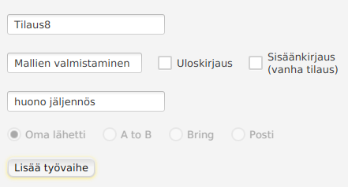

Jos haluat kirjata työn ulos tuotantotiloista, valitse valintaruutu "Uloskirjaus". Tällöin lisätietoja ei voi lisätä, mutta voit valita käytettävän lähettipalvelun.

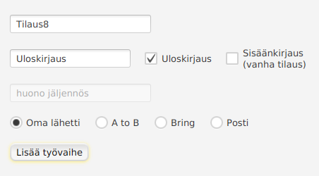

### Etsi tilaus koodilla

Voit hakea tilauksen koko seurantahistorian nähtäville valitsemalla oikeasta reunasta 'Etsi tilaus koodilla'.
Syötä haluamasi tilauskoodi ja klikkaa 'Etsi tilaus', jos tilausta ei löydy, tulee virheviesti. Muussa tapauksessa alhaalle ilmestyy taulukko, jossa näkyy aikajärjestyksessä kaikki tälle tilaukselle tehdyt työvaiheet ja niiden tekijät.

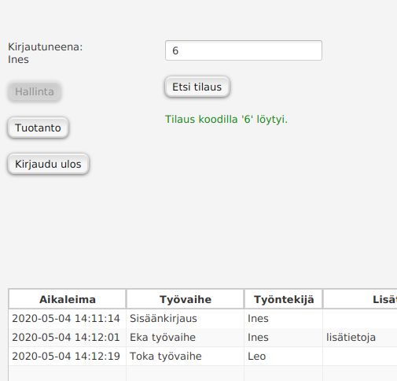

### Etsi tilaukset päivämäärällä

Voit hakea tämän päivän viimeisimmät tehdyt työvaiheet valitsemala oikeasta reunasta 'Etsi tilaukset päivämäärällä'.
Painikkeesta 'Tänään' saat päivämääräkenttään valmiiksi täytettynä järjestelmän aikaan perustuvan päivämäärän tälle päivälle. Voit myös kirjoittaa päivämäärän itse, mutta muista oikea muoto! (vvvv-kk-pp) Klikkaa sitten 'Etsi tilaukset'.
Ohjelma ilmoittaa jos muoto on väärä tai jos päivän aikana ei ole käsitelty yhtään tilausta.

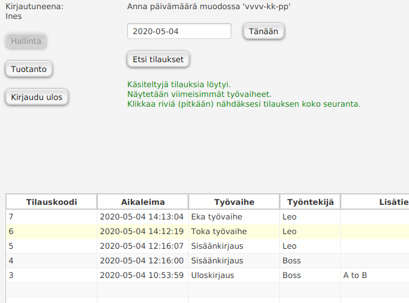

Jos käsiteltyjä tilauksia löytyy, ohjelma näyttää jokaisesta tilauksesta vain viimeisimpänä tehdyn työvaiheen. Jos haluat nähdä tietyn tilauksen koko seurannan, klikkaa kyseistä tilausta pitkään, niin näkymä vaihtuu.

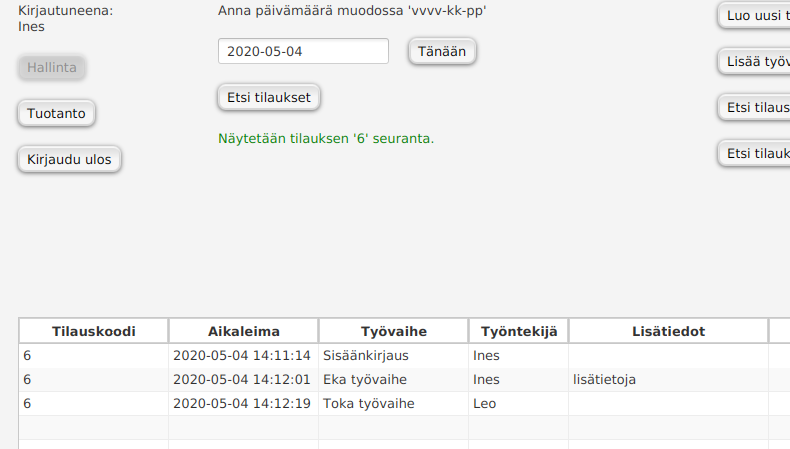

