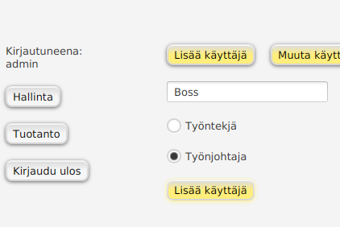

# Käyttöohje

Lataa tiedosto [tuotannonohjaus_vk6.jar](https://github.com/Skorp7/ot-harjoitustyo/releases/tag/viikko6)

Ohjelma luo käynnistyessään tietokantatiedoston *datafile.db* samaan kansioon, johon .jar-tiedosto on ladattu. Jos olet ladannut saman ohjelman eri version aiemmin, kannattaa poistaa vanha versio ja vanha tietokantatiedosto ennen käynnistämistä.

## Ohjelman käynnistäminen

Ohjelman voi käynnistää komentoriviltä menemällä siihen kansioon jossa .jar-tiedosto sijaitsee ja kirjoittamalla komennon:

```
java -jar tuotannonohjaus_vk6.jar
```

## Sisäänkirjautuminen

Käynnistyksen jälkeen voi kirjautua sisään tunnuksella 'admin', jolla on kaikki käyttöoikeudet. Kirjoita nimi kenttään ja klikkaa 'Kirjaudu sisään'.


## Uuden käyttäjän lisääminen ja poistaminen

On suositeltavaa että käyt ensimmäisenä luomassa toisen tunnuksen, jolla on kaikki käyttöoikeudet ja poistat tunnuksen 'admin'.

Uusi käyttäjä lisätään menemällä vasemmanpuoleisesta valikosta kohtaan 'Hallinta'. Aukeaa hallinta-näkymä joka aukeaa vain *Työnjohtajan* oikeuksilla.


Valitse sitten oikeanpuolimmaisesta valikosta 'Käyttäjänhallinta' ja 'Lisää käyttäjä'. Valitse käyttäjärooliksi *Työnjohtaja*.



Klikkaa painiketta 'Lisää käyttäjä'. Ruutuun tulee palaute, onnistuiko käyttäjän lisääminen vai ei.
Jos onnistui, nyt voit halutessasi poistaa tunnuksen 'admin'. Se onnistuu menemällä ylävalikosta kohtaan 'Poista käyttäjä'. Kirjoita tekstikenttään 'admin' ja klikkaa "Poista käyttäjä". Vastaa myös varoitusviestiin OK. Ohjelma kirjaa sinut nyt automaattisesti ulos ja voit kirjautua takaisin sisään juuri luomallasi toisella tunnuksella.


