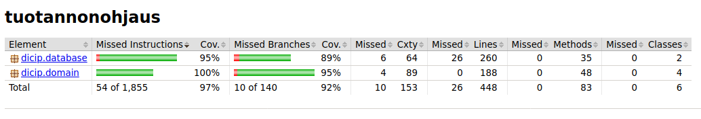

# Testausdokumentti

Ohjelmaa on testattu automaattisesti JUnit-testeillä sekä manuaalisesti järjestelmätasolla.

## Yksikkö- ja integraatiotestaus

### Sovelluslogiikka

Automaattiset JUnit-testit noudattavat samaa logiikkaa kuin pakkauksetkin. Pakkauksen *domain* olioille *User*, *Order* ja *WorkPhase* on omat testiluokkansa *UserTest*, *OrderTest* ja *WorkPhaseTest*.
Luokan *Service* testit on hajautettu selkeyden vuoksi kolmeksi testiluokaksi jotka ovat:
- *ServiceUserTest* joka testaa *Servicen* toiminnallisuuksia olioihin *User* liittyen.
- *ServiceOrderTest* joka testaa *Servicen* toiminnallisuuksia olioihin *Order* liittyen.
- *ServiceTest* joka testaa *Servicen* loput toiminnallisuudet esim. tilausten ja työvaiheiden laskentaan liittyen sekä tietokannan alustukset ja tyhjennykset.

Osittain automaattisen testuksen ulkopuolelle jäi päivämääriin liittyvää laskentaa tekevät metodit. Ne testattiin manuaaliesti syöttämällä tietokantaan tiettyjä päivämääriä ja tarkistamalla tulokseksi saatujen lukujen täsmäävyys.

Automaattiset testit käyttävät tiedon pysyväistallennuksen sijaan rajapinnan *Data* toteuttavaa *DataMap*-luokkaa, joka tallentaa tietoa vain listoihin tietokannan sijaan.
Sovelluslogiikkaa on testattu myös pysyväistallentavan *Data*-rajapinnan toteuttavan luokan *DataSql* kanssa sekä manuaalisesti että automaattisesti. Lopullisesta versiosta automatisoitu SQL-tietokantaa käyttävä testaus on poistettu sovelluslogiikan osalta.

### Tietokantaa käsittelevä luokka

Ohjelman tietokantaa (SQL) käsittelevä luokka *DataSql* on testattu sekä automaattisilla JUnit-testeillä että manuaalisesti. Testiluokka on nimeltään *DataTest*.
Testaus on toteutettu testitietokannalla, eli testit käsittelevät eri tietokantatiedostoa kuin itse sovellus.

### Testauskattavuus

Sovelluksen testauksen rivikattavuus on 97% ja haarautumiskattavuus 92% kun käyttöliittymäkerros jätetään huomiotta. 

Testauksen ulkopuolelle jäivät tilanteet, joissa tapahtuu esimerkiksi SQL-poikkeus tai muu virhetilanne esimerkiksi tiedoston käsittelyn yhteydessä.

## Järjestelmätestaus

Sovelluksen järjestelmätestaus on suoritettu manuaalisesti.

### Asennus ja konfigurointi

Sovellus on ladattu ja testattu [käyttöohjeen](https://github.com/Skorp7/ot-harjoitustyo/blob/master/dokumentointi/kayttoohje.md) kuvaamalla tavalla 
Linux-ympäristössä (käyttöjärjestelmänä Cubbli), kansiossa johon on ladattu myös *config.properties*-tiedosto.

Sovellusta on testattu niin että tietokantatiedostoa ei ole ollut valmiiksi olemassa ja sovellus on luonut sen itse, sekä siinä tilanteessa, että oikeanlainen tietokantatiedosto on jo ollut olemassa.

### Toiminnallisuudet

Kaikki [määrittelydokumentissa](https://github.com/Skorp7/ot-harjoitustyo/blob/master/dokumentointi/maarittelydokumentti.md) mainitut toiminnot on tarkistettu. On myös kokeiltu syöttää vääriä arvoja tai jättää kenttiä täyttämättä.

## Sovellukseen jääneet laatuongelmat

Sovellus ei anna tällä hetkellä järkeviä virheilmoituksia jos:
- konfiguraation määrittelemiin tiedostoihin ei ole luku/kirjoitusoikeuksia
- jos konfiguraatiotiedosto puuttuu
- jos tietokantatiedosto on vaurioitunut (silloin se täytyy vain poistaa jotta sovellus luo uuden toimivan tilalle)

Tilasto-näkymässä näytettävä *'Eniten tehtyjä työvaiheita'* -kohta näyttää sen käyttäjän, joka on tehnyt eniten työvaiheita. Kuitenkin jos useammalla käyttäjällä on sama määrä tehtyjä työvaiheita, kohdassa näkyy satunnaisesti vain joku heistä, eikä kaikki.
